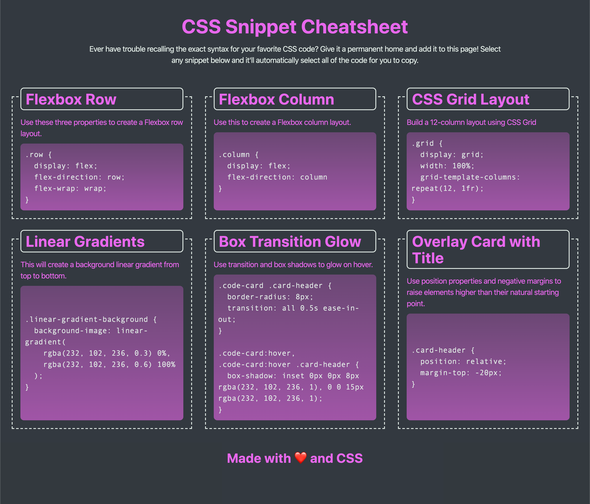

# <CSS-Snippet-Cheatsheet>

# CSS Snippet Cheatsheet

## Summery
This project is about a simple web-page that will hold a collection of CSS snippets.

## Built with

* Website crated With HTML language.
* Add custom styling with CSS framework.
* Use flexbox and media queries to create a responsive grid layout.

* Each CSS snippet have a card-like layout with the CSS syntax wrapped in an [HTML pre element](https://developer.mozilla.org/en-US/docs/Web/HTML/Element/pre).

* Each CSS snippet easily be highlighted for copying on click using the [CSS user-select property](https://developer.mozilla.org/en-US/docs/Web/CSS/user-select).

* Encorporate a background color using a [CSS linear-gradient function](https://developer.mozilla.org/en-US/docs/Web/CSS/linear-gradient).

* Incorporate a bit of animation using the [CSS transition property](https://developer.mozilla.org/en-US/docs/Web/CSS/transition).

## Instructions

This application meet the following criteria:

* Collection of labeled CSS snippets in a responsive grid.

* Easily identify these CSS snippets by their headings.

* Highlight a code snippet by clicking on it.

* Responsive view application on a mobile device as well as a desktop.

## Link
You can experience the deployed project here: [CSS Snippet Cheatsheet URL](https://hadisparsa.github.io/CSS-Snippet-Cheatsheet/).

## The following demo shows the web application's appearance and functionality:

  * At size 992px and above, the app is resemble the following image:

    

  * At size 768px and above, the app is resemble the following image:

    

  * On mobile devices, anything under 768px, the app is resemble the following image:

    

